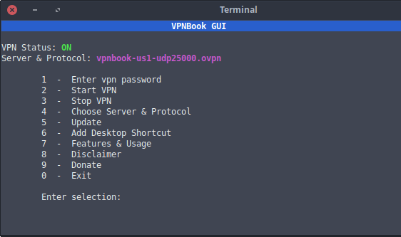

# VPNBook GUI v2.0

A simple bash script gui to manage and control [VPNBook.com](https://www.vpnbook.com/)'s vpn service.

Tested on ubuntu & xubuntu

### Project Page
https://intechgeek.com/free-vpn-for-linux/
