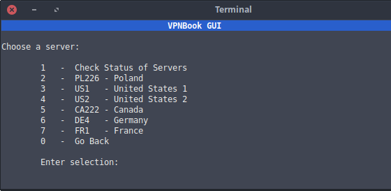
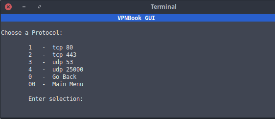

# VPNBook GUI v1.6

A simple bash script gui to manage and control [VPNBook.com](https://www.vpnbook.com/)'s vpn service.

Tested on ubuntu 16.04

## Usage
Make sure the "vpn" file has execute permissions.

1. Execute the file as follows in a terminal: `./vpn`
2. optional - Create desktop shortcut for quick access

### Project Page
https://intechgeek.com/free-vpn-for-linux/
